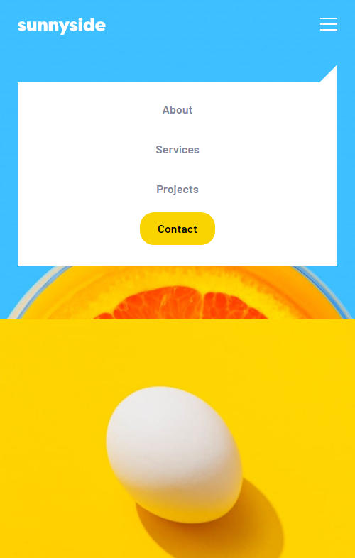

## Table of contents

- [Overview](#overview)
  - [Screenshot](#screenshot)
  - [Links](#links)
- [My process](#my-process)
  - [Built with](#built-with)
  - [What I learned](#what-i-learned)
- [Author](#author)

## Overview

### Screenshot

[Live Site URL](https://sonndy.github.io/Coming-Soon-Apparel-site/)

## My process

### Built with

- Semantic HTML5 markup
- CSS Grid
- CSS Flexbox
- Mobile-first workflow
- React Js

### What I learned
Designing this website by only using small react components help strenghen my react foundation which i can build upon to become an expert in react.

## Author

- Website - [Sonndy Exantus](https://sonndy.com/)
